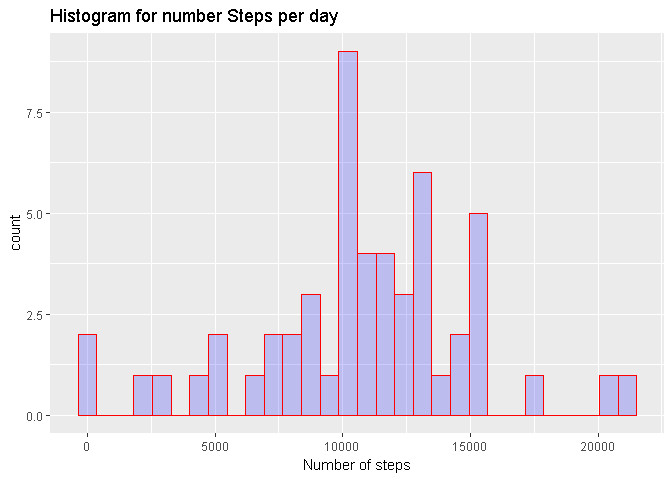
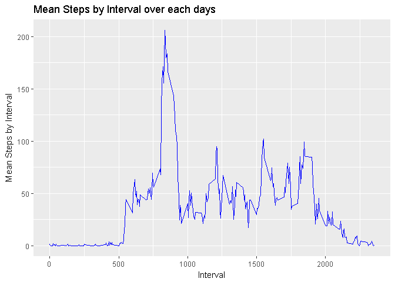
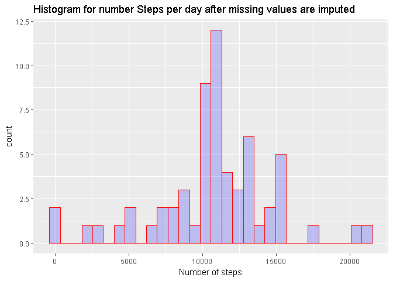
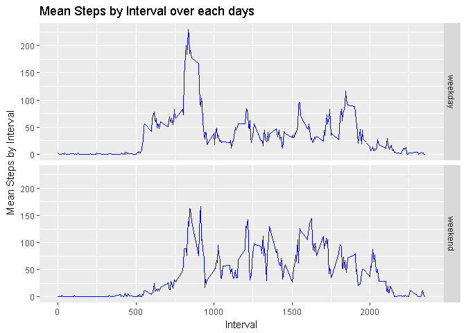

# Reproducible Research: Peer Assessment 1


## Loading and preprocessing the data

Load data to *activity* dataset:


```r
library(data.table)
library(dplyr)
library(ggplot2)
activity <- fread('activity.csv')
```

## What is mean total number of steps taken per day?

Get *step_by_day* dataset - Number of steps per each day:

```r
step_by_day <- activity %>% 
  group_by(., date) %>% 
  summarise(SumSteps = sum(steps))
```
Mean total number of steps taken per day:

```r
mean(step_by_day$SumSteps, na.rm = T)
```

```
## [1] 10766.19
```
Median total number of steps taken per day:

```r
median(step_by_day$SumSteps, na.rm = T)
```

```
## [1] 10765
```
Histogram for number Steps per day:

```r
qplot(step_by_day$SumSteps,
      geom="histogram",
      main = "Histogram for number Steps per day", 
      xlab = "Number of steps",  
      fill=I("blue"), 
      col=I("red"), 
      alpha=I(.2))
```

<!-- -->

## What is the average daily activity pattern?

Get *daily_pattern* dataset - average number of steps per each interval over all days:


```r
daily_pattern <- activity %>% 
  group_by(., interval) %>% 
  summarise(MeanStepsByInterval = mean(steps, na.rm = T))
```

Time series plot of the average number of steps per each interval over all days:


```r
ggplot(daily_pattern, aes(interval, MeanStepsByInterval))  + geom_line(color = 'blue') +
  xlab("Interval") + ylab("Mean Steps by Interval") +
  ggtitle("Mean Steps by Interval over each days")
```

<!-- -->

The 5-minute interval that, on average, contains the maximum number of steps:


```r
daily_pattern[which.max(daily_pattern$MeanStepsByInterval),1]
```

```
## # A tibble: 1 x 1
##   interval
##      <int>
## 1      835
```

## Imputing missing values

Count missing values:

```r
sum(is.na(activity$steps))
```

```
## [1] 2304
```
Strategy for filling in all of the missing values in the dataset:replace them on mean for that 5-minute interval. Get *activity_new* dataset with replaced missing values:


```r
activity_new = activity
activity_new$steps[is.na(activity_new$steps)] <- inner_join(activity_new, daily_pattern)$MeanStepsByInterval[is.na(activity_new$steps)]
```

Check what NA is not exists in *activity_new* dataset:

```r
sum(is.na(activity_new$steps))
```

```
## [1] 0
```
Get *step_by_da_newy* dataset - Number of steps per each day, when NA values replaced on mean per interval:

```r
step_by_day_new <- activity_new %>% 
  group_by(., date) %>% 
  summarise(SumSteps = sum(steps))
```
New Mean total number of steps taken per day:

```r
mean(step_by_day_new$SumSteps)
```

```
## [1] 10766.19
```
New Median total number of steps taken per day:

```r
median(step_by_day_new$SumSteps)
```

```
## [1] 10766.19
```
Histogram of the total number of steps taken each day after missing values are imputed:

```r
qplot(step_by_day_new$SumSteps,
      geom="histogram",
      main = "Histogram for number Steps per day after missing values are imputed", 
      xlab = "Number of steps",  
      fill=I("blue"), 
      col=I("red"), 
      alpha=I(.2))
```

<!-- -->

## Are there differences in activity patterns between weekdays and weekends?
Add to *activity_new* dataset new factor variable: TypeDate - define day is weekday or weekend day: 

```r
Sys.setlocale("LC_TIME", "English")
```

```
## [1] "English_United States.1252"
```

```r
activity_new$DayOfWeek <-  weekdays(as.Date(activity_new$date), abbr =TRUE)
activity_new$TypeDate <- as.factor(ifelse(grepl("S(at|un)", activity_new$DayOfWeek),'weekend','weekday'))
```
Get *daily_pattern_new* dataset - average number of steps per each interval and TypeDate (weekend or weekday) over all days:

```r
daily_pattern_new <- activity_new %>% 
  group_by(., interval, TypeDate) %>% 
  summarise(MeanStepsByInterval = mean(steps, na.rm = T))
```
Time series plot of the average number of steps per each interval over all days divided by TypeDate (weekend or weekday):

```r
ggplot(daily_pattern_new, aes(interval, MeanStepsByInterval))  + geom_line(color = 'blue') +
  xlab("Interval") + ylab("Mean Steps by Interval") +
  ggtitle("Mean Steps by Interval over each days") +
  facet_grid(TypeDate ~.)
```

<!-- -->
